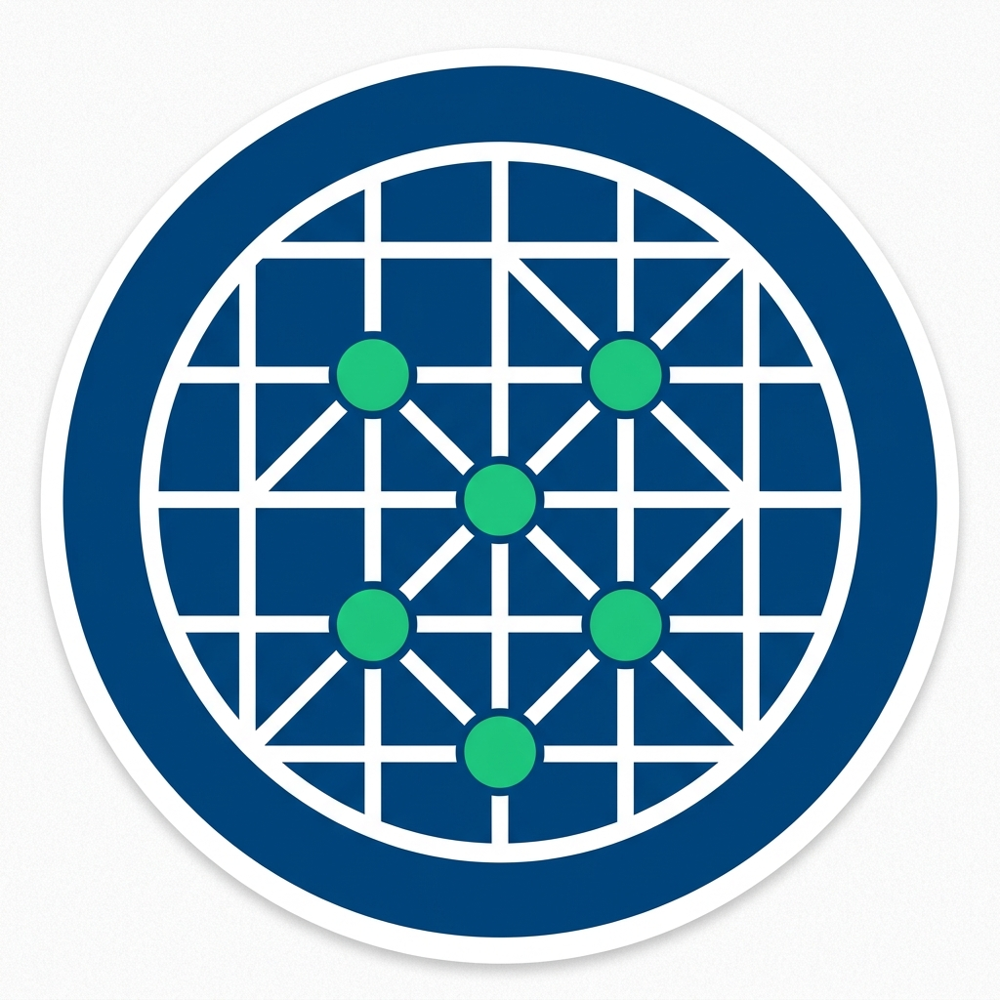

<div align="center">



# 🌌 FedMesh
### A Federated Learning Framework for Privacy-Preserving Mesh Quality Evaluation

[](https://opensource.org/licenses/MIT)
[](https://pytorch.org/)
[](https://en.wikipedia.org/wiki/Computational_fluid_dynamics)

---

</div>

**FedMesh** is a pioneering federated learning framework designed specifically for **2D structured mesh quality assessment** in Computational Fluid Dynamics (CFD). It enables several organizations to collaboratively train high-performance evaluation models without sharing sensitive geometric designs.

## 🚀 Key Features

- **🛡️ Privacy-First:** Native federated learning architecture ensures zero raw data exchange.
- **🛰️ ScaMoon Algorithm:** A novel hybrid strategy combining SCAlable Direction Correction and MOON-inspired representation alignment.
- **📈 Robust to Non-IID:** Specifically engineered to handle extreme data heterogeneity (varying mesh scales and topologies).
- **🎯 Superior Performance:** Outperforms SOTA FL baselines (FedAvg, Scaffold, MOON) and matches centralized training accuracy.

---

## 🧠 Core Methodology: ScaMoon

The core of FedMesh is the **ScaMoon** algorithm, addressing scientific challenges including "client drift" and "representation bias" through two elegant phases:

### 1. 🧭 Direction Correction Phase
Inspired by **SCAFFOLD**, this phase uses momentum-based control variates and **Gradient Normalization** to stabilize the optimization trajectory, preventing the global model from being "pulled away" by large-scale mesh clients.

### 2. ✨ Feature Refinement Phase
Leveraging **Multi-Scale Contrastive Learning**, this phase aligns features across low, mid, and high semantic layers. This forces the local encoder to learn invariant defect features that are robust to varying mesh connectivity and distortions.

---
## 🛠️ Installation

```bash
# 1. Clone the repository
git clone https://github.com/KorenTend/FedMesh.git
cd FedMesh

# 2. Setup environment
conda create -n fedmesh python=3.9
conda activate fedmesh

# 3. Install dependencies
pip install torch torchvision torchaudio --index-url https://download.pytorch.org/whl/cu121
pip install scikit-learn numpy tqdm matplotlib seaborn
```

## 🏃 Quick Start

Run the training script with the ScaMoon strategy:

```bash
python main.py \
    --strategy ScaMoon \
    --communication_rounds 200 \
    --local_epochs 3 \
    --learning_rate 2e-5 \
    --warmup_rounds 30
```

---
---

## 📧 Contact & Support

Maintainer: litind@163.com
Research conducted at: **Beijing Technology and Business University** (BTBU)
